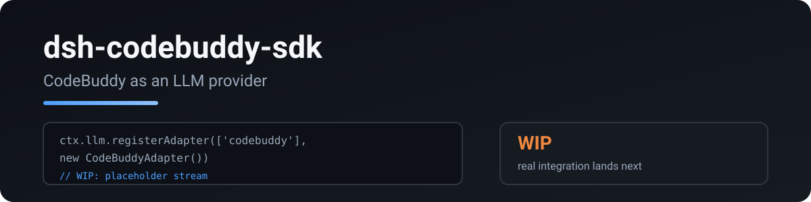

<p align="center">
  
</p>

# dsh-all-search

Adds a web-search provider to DeepSeek Harness, registered into `ctx.web`. AnySearch is a single MCP gateway that aggregates exa / tavily / firecrawl / context7 behind **one API key**. Optional **TinyFish** search adds free news and academic results, and its full-browser fetch can render JavaScript-heavy pages.

When `api_key` is set, queries go to that gateway. When it is absent, the same `anysearch` provider stays available and searches via **Firecrawl** `POST /v1/search` with no `Authorization` header (keyless). Set optional `firecrawl_api_key` to send `Authorization: Bearer` and use your own quota. NAT/CI runners that share an egress IP share that keyless daily credit pool.

With `firecrawl_api_key` and an AnySearch key, developer-intent queries (repo / issue / PR / commit / skill) are answered by the **Firecrawl Developer Index** first -- a semantic artifact index over READMEs, issues, PRs, OpenAPI specs and skills -- falling back to AnySearch when it fails or returns nothing.

With `tinyfish_api_key`, news and academic queries route to TinyFish first (`domain_type=news` / `research_paper`), then fall back to AnySearch or Firecrawl. Set `tinyfish_fetch: true` to also register TinyFish as the fetch provider for full-browser page rendering.

> Port of [pi-all-search](https://github.com/RealAlexandreAI/pi-all-search).

[English](README.md) · [中文](README.zh.md)

## Why

dsh ships Exa / Perplexity / DeepSeek search. This plugin adds AnySearch: one key, many backends, no per-backend credentials. Without an AnySearch key, Firecrawl still works so the provider is never a no-op.

## Quick start

```sh
dsh plugin --profile web add dsh-all-search
```

The provider registers as `anysearch` on `ctx.web` -- the built-in `web_search` tool picks it up alongside the stock providers.

```yaml
- id: all-search
  name: dsh-all-search
  config:
    api_key: <your anysearch key>   # optional
```

| key | required | meaning |
|---|---|---|
| `api_key` | - | AnySearch key. When set, queries use the AnySearch gateway. |
| `base_url` | - | MCP endpoint override |
| `firecrawl_api_key` | - | optional Firecrawl key (Bearer quota). Also enables the Developer Index branch for repo/issue/PR/skill queries when AnySearch is configured |
| `tinyfish_api_key` | - | optional TinyFish key. Enables free news/academic search and full-browser fetch. |
| `tinyfish_fetch` | - | register TinyFish as the fetch provider (default `false`; the host usually supplies a local fetch provider) |

Without an AnySearch key the provider still reports `available() = true` and searches Firecrawl keyless. Hosts that share an egress IP (NAT, CI) share those daily credits; set `firecrawl_api_key` for a private quota.

Search routing with a TinyFish key: developer queries → Developer Index → TinyFish (news/academic) → AnySearch → Firecrawl. Every key is optional, so any subset of providers still answers queries.

## Privacy

- Keys live only in your config file -- never logged.
- With `api_key`, only your query and result count go to the AnySearch gateway.
- Without `api_key`, the query goes to Firecrawl `/v1/search`.
- With `tinyfish_api_key`, TinyFish keeps every query and fetched URL under its `/usage` endpoint. Treat it as a non-private retrieval layer.

## Development

```bash
npm install
npm run typecheck
npm test          # result parsing / maxResults / HTTP errors / keyless Firecrawl routing
npm run build
```

Live search test:

```bash
node --import tsx tests/real/real-search.mjs
```

## License

MIT
