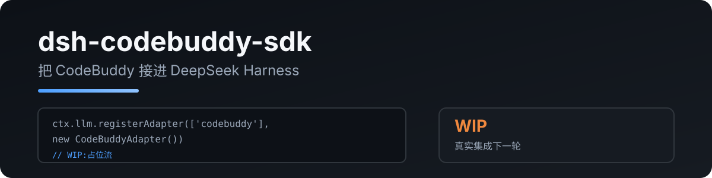

<p align="center">
  
</p>

# dsh-codebuddy-sdk

把 **CodeBuddy**(腾讯 Agent SDK)注册为 DeepSeek Harness 的 LLM provider 适配器(`ctx.llm`)。

> 由 [pi-codebuddy-sdk](https://github.com/RealAlexandreAI/pi-codebuddy-sdk) 移植。

[English](README.md) · [中文](README.zh.md)

## 状态 — WIP 骨架

> 目前是骨架:适配器能挂载、能流式返回占位响应,但**真实集成还没接**:
>
> - ❌ 多轮消息翻译(`GenerateOptions.messages` → CodeBuddy)
> - ❌ 工具调用流式输出(dsh `StreamChunk` 工具块)
> - ❌ 本机 `codebuddy` CLI 联调
>
> 进度看 [RealAlexandreAI/dsh-codebuddy-sdk/issues](https://github.com/RealAlexandreAI/dsh-codebuddy-sdk/issues)。

## 快速开始

```sh
dsh plugin add dsh-codebuddy-sdk
```

需要 `codebuddy` CLI 在 `PATH` 上(与 pi-codebuddy-sdk 相同要求)。

```yaml
- id: codebuddy
  name: dsh-codebuddy-sdk
  config:
    provider: codebuddy   # provider 路由(默认 codebuddy)
    model: codebuddy      # 默认模型 ID(默认 codebuddy)
```

## 隐私

- 只与本地 `codebuddy` CLI 通信,不额外发网络请求
- 本插件不读取、不存储任何凭据(复用 CLI 自身认证)

## 开发

```bash
npm install
npm run typecheck
npm test          # 挂载 + 占位流 smoke
npm run build
```

## License

MIT
