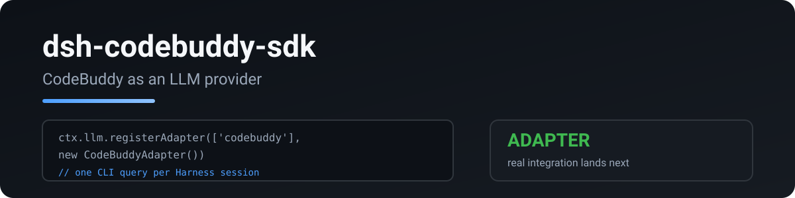

<p align="center">
  
</p>

# dsh-codebuddy-sdk

Registers **CodeBuddy** (Tencent Agent SDK) as an LLM provider adapter for DeepSeek Harness (`ctx.llm`), so the Harness can run a CodeBuddy model while keeping its own tools, session, and UI.

> Port of [pi-codebuddy-sdk](https://github.com/RetiredPhysicist/pi-plugins/tree/main/packages/pi-codebuddy-sdk).

[English](README.md) · [中文](README.zh.md)

## What it does

- Advertises the CLI's own model catalog on the `codebuddy` provider route
- Streams text, reasoning, and tool calls into the Harness `StreamChunk` protocol
- Bridges Harness tools to CodeBuddy through an in-process SDK MCP server, so the Harness still executes every tool
- Re-imports the Harness history into a CodeBuddy session file and resumes it per step, which is what makes multi-turn context survive the per-step CLI lifetime
- Reaps the CLI child process on every completion path, including model discovery and aborts

## Quick start

```sh
dsh plugin add dsh-codebuddy-sdk
```

Requires the `codebuddy` CLI on `PATH`, signed in (`codebuddy` works standalone).

```yaml
- id: codebuddy
  name: dsh-codebuddy-sdk
  config:
    provider: codebuddy            # provider route (default codebuddy)
    model: hy3-preview-agent-ioa   # default model id (default: CLI's own default)
    # pathToCodebuddyCode: /opt/homebrew/bin/codebuddy
    # permissionMode: bypassPermissions
```

Pick the model with the Harness model selector; `codebuddy/<id>` routes through this adapter.

## Configuration

| key | default | meaning |
|---|---|---|
| `provider` | `codebuddy` | provider route registered with `ctx.llm` |
| `model` | CLI default | model id sent when the request names none |
| `pathToCodebuddyCode` | `PATH` lookup | explicit CLI path |
| `cwd` | process cwd | working directory for the CLI |
| `permissionMode` | `bypassPermissions` | CLI permission mode; the Harness owns tool approval |
| `contextWindow` | estimated | context window override for every model |
| `maxTokens` | estimated | output cap override for every model |

## Privacy

- Talks to the local `codebuddy` CLI only; no extra network hop.
- No credentials are read or stored; the CLI's own auth is reused.
- Tool arguments and results pass between the Harness and the CLI over the local control protocol.

## Development

```bash
npm install
npm run typecheck
npm run test:ci            # unit tests, no CLI or credentials needed
npm run test:integration   # opt-in, needs a signed-in codebuddy CLI
npm run build
```

## License

MIT

<!-- ci-parallel bench 2026-10-07T08:32:52+08:00 -->
