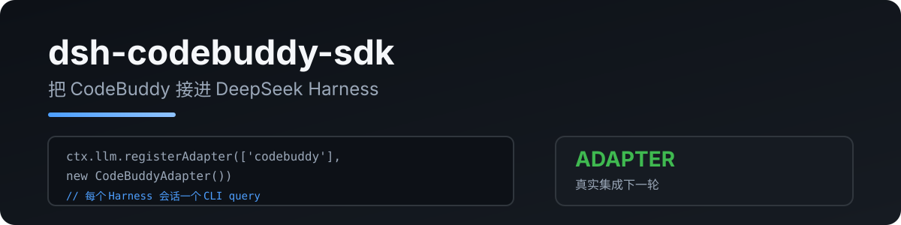

<p align="center">
  
</p>

# dsh-codebuddy-sdk

把 **CodeBuddy**(腾讯 Agent SDK)注册为 DeepSeek Harness 的 LLM provider 适配器(`ctx.llm`):模型走 CodeBuddy,工具、会话、界面仍由 Harness 掌管。

> 由 [pi-codebuddy-sdk](https://github.com/RetiredPhysicist/pi-plugins/tree/main/packages/pi-codebuddy-sdk) 移植。

[English](README.md) · [中文](README.zh.md)

## 功能

- 在 `codebuddy` 路由上暴露 CLI 自己的模型目录
- 把文本、思维链、工具调用转成 Harness 的 `StreamChunk` 协议
- 通过进程内 SDK MCP server 把 Harness 工具桥接给 CodeBuddy,工具仍由 Harness 执行
- 每步把 Harness 历史写入 CodeBuddy 会话文件并 resume,因此多轮上下文能在 CLI 的「每步一个进程」模型下保留
- 所有结束路径(包括模型发现与中断)都会回收 CLI 子进程

## 快速开始

```sh
dsh plugin add dsh-codebuddy-sdk
```

需要 `codebuddy` CLI 在 `PATH` 上且已登录(即终端里 `codebuddy` 能正常用)。

```yaml
- id: codebuddy
  name: dsh-codebuddy-sdk
  config:
    provider: codebuddy            # provider 路由(默认 codebuddy)
    model: hy3-preview-agent-ioa   # 默认模型 ID(默认用 CLI 自带默认值)
    # pathToCodebuddyCode: /opt/homebrew/bin/codebuddy
    # permissionMode: bypassPermissions
```

在 Harness 的模型选择器里选 `codebuddy/<id>` 即可走这个适配器。

## 配置

| 键 | 默认 | 说明 |
|---|---|---|
| `provider` | `codebuddy` | 注册到 `ctx.llm` 的路由名 |
| `model` | CLI 默认 | 请求未指定模型时发送的模型 ID |
| `pathToCodebuddyCode` | 从 `PATH` 查找 | 显式指定 CLI 路径 |
| `cwd` | 进程 cwd | CLI 工作目录 |
| `permissionMode` | `bypassPermissions` | CLI 权限模式;工具审批由 Harness 负责 |
| `contextWindow` | 估算值 | 覆盖所有模型的上下文窗口 |
| `maxTokens` | 估算值 | 覆盖所有模型的输出上限 |

## 隐私

- 只与本地 `codebuddy` CLI 通信,不额外发网络请求
- 不读取、不存储任何凭据(复用 CLI 自身认证)
- 工具参数与结果只在 Harness 与 CLI 的本地控制协议之间传递

## 开发

```bash
npm install
npm run typecheck
npm run test:ci            # 单元测试,不需要 CLI 或凭据
npm run test:integration   # 可选,需要已登录的 codebuddy CLI
npm run build
```

## License

MIT
